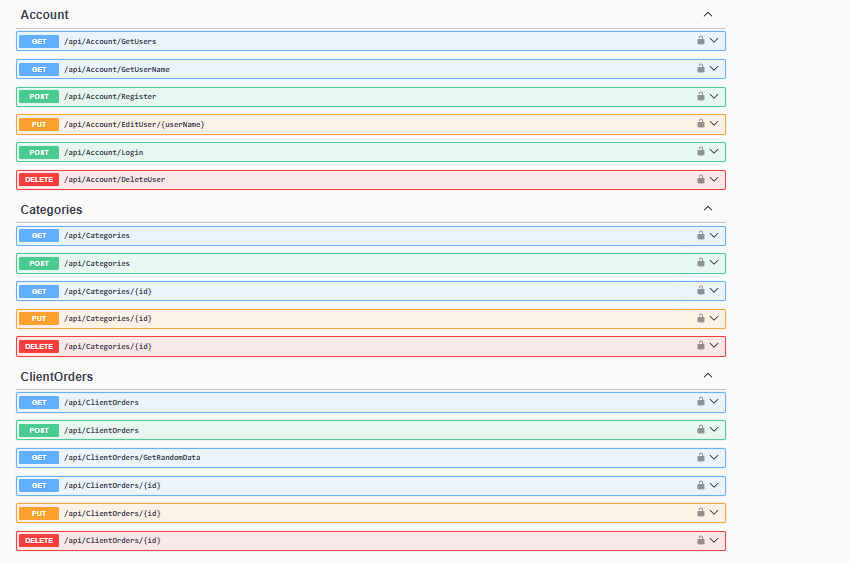
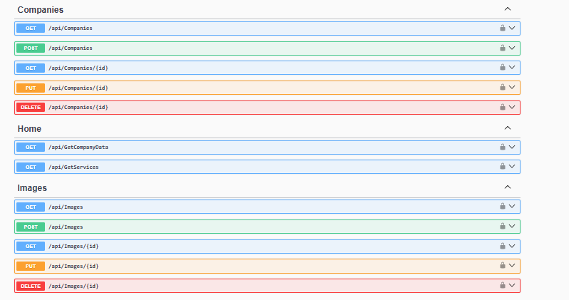
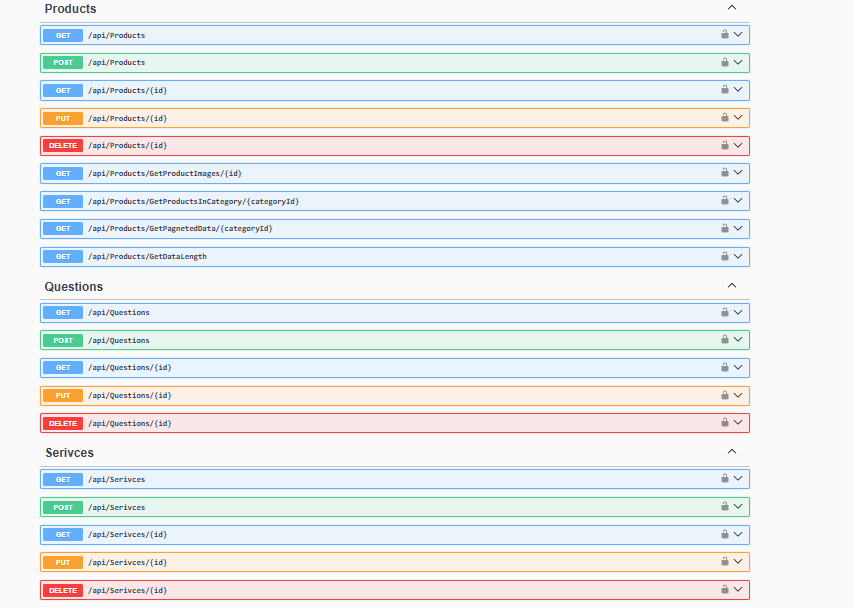
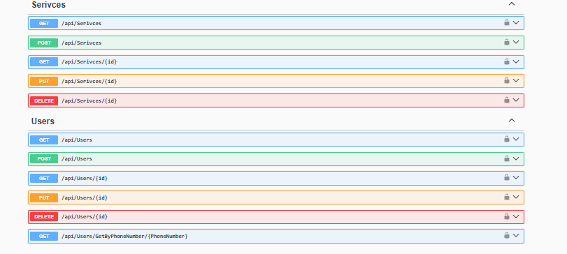

# 🏢 Company Management System - RESTful API

This project is structured based on clean architecture principles and is divided into three main layers to ensure scalability and maintainability.

---

## 📁 Project Architecture

The solution is divided into the following layers:

1. **Presentation Layer**
   - Responsible for handling HTTP requests and responses.
   - Exposes RESTful API endpoints for client-side consumption.

2. **Business Logic Layer (BL)**
   - Contains the core business rules and logic.
   - Coordinates operations between the data and presentation layers.

3. **Data Access Layer (DAL)**
   - Handles direct communication with the database.
   - Implements the Repository and Unit of Work patterns for clean and testable data access.

---

## 🧱 Architectural Patterns Used

- **Repository Pattern**
  - Provides an abstraction over data access logic.
  - Promotes code reusability and separation of concerns.

- **Unit of Work Pattern**
  - Manages transactions across multiple repositories.
  - Ensures atomicity and consistency.

- **Microsoft Identity**
  - Integrated for authentication and role-based authorization.
  - Allows secure login and access control management.

---

## 🔐 Admin Features

Users with the **Admin** role have the ability to:

- Add, update, and delete **Company Information**.
- Manage **Products** and **Product Categories**.
- Upload and manage **Product Images**.
- Create, update, and delete **Company Services**.
- View, edit, and delete **Customer Orders** and **Contact Messages**.

---

## 🌐 RESTful API

The system provides a fully functional **RESTful API**, following best practices for routing, naming conventions, and data handling.

- All endpoints return standardized HTTP status codes.
- Input validation and error handling are implemented.
- Secured access using JWT tokens and Microsoft Identity.

---

## 🚀 Technologies Used

- ASP.NET Core API
- Entity Framework 6 (EF6)
- Microsoft Identity
- SQL Server
- Repository + Unit of Work Patterns
  

---

## 🧪 Testing & Validation

- Validations are enforced at both DTO and model levels.

---
## EndPoints Images 
-
-
-
-

